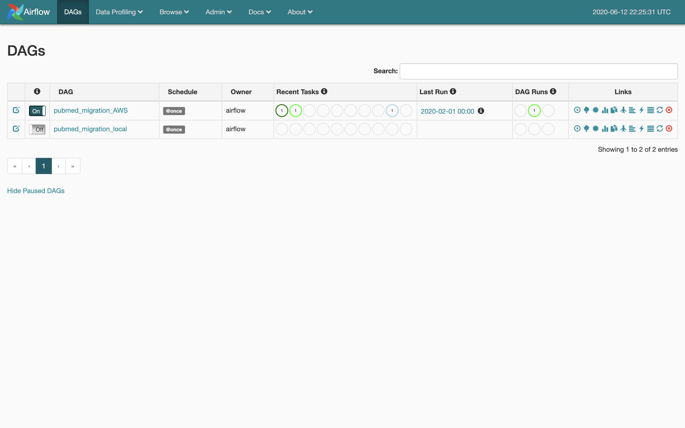

# airflow-casereports

## Description

airflow-casereports is a workflow management platform for ACROBAT data pipelines.

## Deployment Instructions

airflow-casereports is deployed on an EC2 instance called DockerHost. The current deployment process is to clone the project into the EC2 instance and run via docker. You will need to set up git/github and ssh keys. You may also need to set up AWS credentials.
```
# Update YUM
sudo yum update

# Install Docker and Docker-Compose
sudo yum install docker
sudo curl -L https://github.com/docker/compose/releases/download/1.21.0/docker-compose-`uname -s`-`uname -m` | sudo tee /usr/local/bin/docker-compose > /dev/null
sudo chmod +x /usr/local/bin/docker-compose
sudo ln -s /usr/local/bin/docker-compose /usr/bin/docker-compose

# Install Git
sudo yum install git -y

# Start Docker Service
sudo service docker start

# Start Airflow
sudo docker-compose up -d
```

## Pipelines
### pubmed\_migration\_aws
pubmed\_migration\_aws is currently the main data-pipeline. The primary function of this pipeline is to extract PubMed case reports from https://ftp.ncbi.nlm.nih.gov/pub/pmc/oa_bulk/, transform the data, and store the results in both our MongoDB and ElasticSearch instance. 

### pubmed\_migration\_local
pubmed\_migration\_local is a date-pipeline simalar to pubmed_migration_aws, but does not persists intermediary data in S3. Presently, there is not enough disk space in our EC2 instance to support this job. 

## Website
<http://ec2-52-42-76-21.us-west-2.compute.amazonaws.com/>

## Author(s)
- Thomas Pan (<thomascpan@g.ucla.edu>)
- Carolyn Yen 

## References
- Apache Airflow: https://airflow.apache.org/
- Docker Airflow: https://github.com/puckel/docker-airflow

